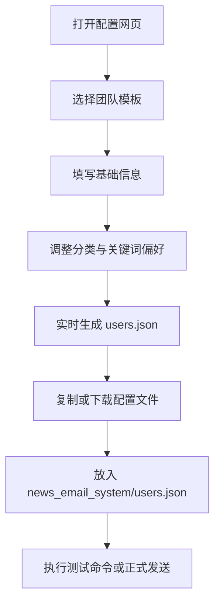

## 1. 产品概述
这是一个给新闻邮件推送系统配套使用的本地网页工具，用来可视化维护团队用户配置、生成 `users.json`，并降低多人复用门槛。
- 解决当前必须手改 JSON 配置、不方便交付给其他同事直接使用的问题。
- 目标是让使用者通过浏览器页面完成收件人、发送时间、主题前缀和新闻偏好配置，并快速落地到系统可识别的配置文件。

## 2. 核心功能

### 2.1 功能模块
1. **首页配置页**：系统说明、模板选择、团队配置编辑、实时预览。
2. **结果导出区**：生成 JSON、复制到剪贴板、下载 `users.json`、显示使用命令。

### 2.2 页面详情
| 页面名称 | 模块名称 | 功能描述 |
|-----------|-------------|---------------------|
| 首页配置页 | 顶部说明区 | 说明该网页用于配置新闻邮件系统，强调共享 SMTP、用户仅需填写收件与偏好 |
| 首页配置页 | 模板切换区 | 可在“团队通用晨报 / 宏观版 / 市场交易版”之间切换，快速加载预设 |
| 首页配置页 | 基础信息区 | 编辑用户标识、名称、收件人、回复地址、标题前缀、发送时间、时区 |
| 首页配置页 | 偏好配置区 | 选择主分类、子分类、包含关键词、排除关键词、最大新闻条数 |
| 首页配置页 | 配置结果区 | 实时生成最终 JSON，并展示将写入 `users.json` 的内容 |
| 首页配置页 | 操作区 | 一键复制 JSON、一键下载文件、显示测试命令和正式发送命令 |

## 3. 核心流程
用户打开网页后，先从团队模板中选择一个版本，然后修改团队名称、收件人、回复地址和偏好设置。页面会实时生成可落地的 `users.json` 内容。用户确认后点击复制或下载，把文件放到 `news_email_system/users.json`，随后直接运行测试命令或正式发送命令。

## 4. 用户界面设计
### 4.1 设计风格
- 整体风格：深色控制台 + 金融终端质感，强调“可配置系统控制面板”的专业感
- 主色：石墨黑、深海军蓝
- 强调色：琥珀金、青蓝色
- 按钮风格：圆角中等、发光描边、悬浮高亮
- 字体：标题使用有金融杂志感的衬线风格，正文使用清晰易读的现代无衬线
- 布局风格：桌面优先的双栏控制台布局，左侧配置，右侧预览与导出
- 图标风格：简洁线性图标，适合数据和系统工具场景

### 4.2 页面设计概览
| 页面名称 | 模块名称 | UI 元素 |
|-----------|-------------|-------------|
| 首页配置页 | 顶部说明区 | 大标题、副标题、状态提示条、轻微渐变背景 |
| 首页配置页 | 模板切换区 | 三个模板卡片、标签徽章、选中高亮 |
| 首页配置页 | 配置表单区 | 分组卡片、输入框、标签按钮、复选项网格 |
| 首页配置页 | JSON 预览区 | 代码面板、语法高亮风格、滚动区域 |
| 首页配置页 | 操作区 | 复制按钮、下载按钮、命令提示块、成功提示 |

### 4.3 响应式
- 采用桌面优先设计，优先满足在电脑端直接维护配置
- 中等屏幕下双栏变单栏
- 手机端保持可查看和复制，但重点体验放在桌面端
