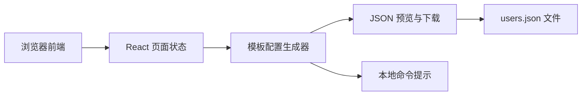
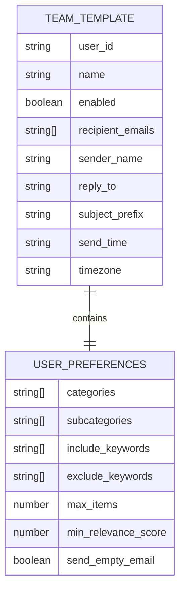

## 1. 架构设计



## 2. 技术说明
- 前端：React 18 + TypeScript + Tailwind CSS 3 + Vite
- 初始化工具：vite-init
- 状态管理：Zustand
- 运行方式：本地开发服务器预览，后续可扩展为静态部署
- 数据来源：页面内置团队模板数据，不依赖后端服务

## 3. 路由定义
| 路由 | 用途 |
|-------|---------|
| / | 团队配置网页首页，用于模板选择、配置编辑和结果导出 |

## 4. API 定义
当前版本不引入后端 API。

页面内部主要类型定义如下：

```ts
type TeamTemplate = {
  user_id: string
  name: string
  enabled: boolean
  recipient_emails: string[]
  sender_name: string
  reply_to: string
  subject_prefix: string
  send_time: string
  timezone: string
  preferences: {
    categories: string[]
    subcategories: string[]
    include_keywords: string[]
    exclude_keywords: string[]
    max_items: number
    min_relevance_score: number
    send_empty_email: boolean
  }
}
```

## 5. 数据模型
### 5.1 数据模型定义



### 5.2 数据定义说明
- 模板数据保存在前端常量中，用户进入网页即可直接使用
- 页面支持将当前表单状态序列化成 `{ users: [...] }` 结构
- 导出结果与 `news_email_system/users.json` 兼容

## 6. 实施约束
- 不修改现有 Python 抓取与发送核心逻辑
- 网页重点解决“配置生成”问题，不直接负责 SMTP 存储和邮件发送
- 页面必须支持复制 JSON、下载文件、显示命令行使用方式
- 页面需具备较强视觉识别度，避免普通表单页观感
